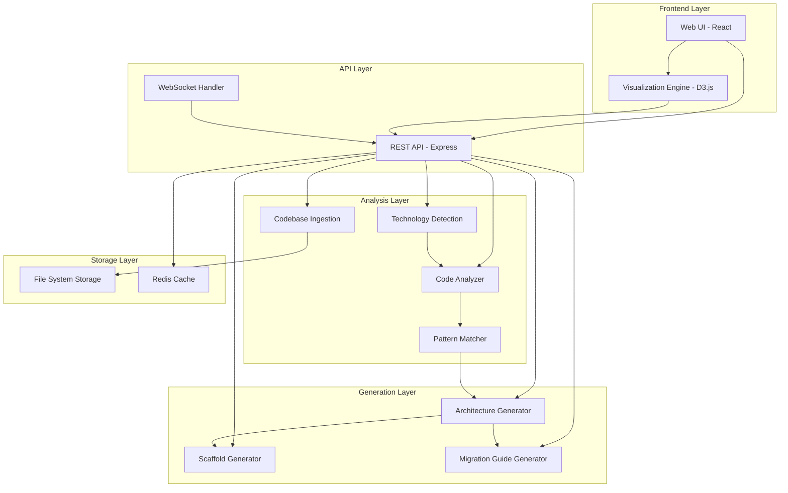
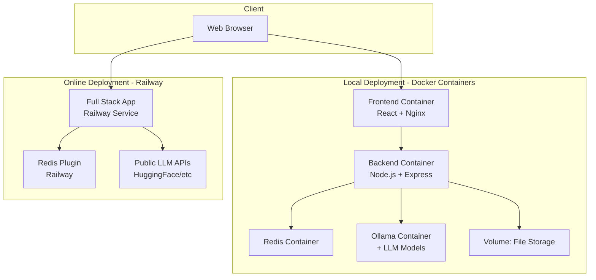

# Design Document

## Overview

The Haunted Refactorium is a web-based code analysis and refactoring recommendation system that combines static code analysis, pattern detection, and AI-powered architecture generation with a Halloween-themed user experience. The system accepts legacy codebases, performs comprehensive analysis, and generates actionable modernization plans with visual feedback.

## Architecture

The system follows a layered architecture with clear separation of concerns:



### Technology Stack

- **Frontend**: React with TypeScript, D3.js for visualizations, Tailwind CSS for styling, react-i18next for internationalization
- **Backend**: Node.js with Express, TypeScript
- **Analysis**: Tree-sitter for parsing, ESLint (for JavaScript) and typescript-eslint (for TypeScript), custom pattern matchers
- **Storage**: File system for temporary codebase storage, Redis for caching analysis results
- **AI Integration**: Ollama for local LLM inference (architecture generation and recommendations)
- **i18n**: i18next for translation management, browser language detection
- **API Documentation**: Swagger/OpenAPI with swagger-jsdoc and swagger-ui-express for interactive API docs
- **Documentation**: VitePress for documentation site with Halloween theming

## Components and Interfaces

### 1. Codebase Ingestion Service

**Responsibilities:**
- Accept repository URLs or file uploads
- Clone repositories or extract archives
- Validate and prepare codebase for analysis

**Interface:**
```typescript
interface IngestionService {
  ingestFromUrl(url: string): Promise<CodebaseMetadata>;
  ingestFromUpload(files: File[]): Promise<CodebaseMetadata>;
  validateCodebase(path: string): Promise<ValidationResult>;
}

interface CodebaseMetadata {
  id: string;
  path: string;
  size: number;
  fileCount: number;
  rootFiles: string[];
}
```

### 2. Technology Detection Service

**Responsibilities:**
- Identify programming languages
- Detect frameworks and their versions
- Parse dependency files (package.json, composer.json, requirements.txt, etc.)

**Interface:**
```typescript
interface TechnologyDetector {
  detectLanguages(codebasePath: string): Promise<LanguageInfo[]>;
  detectFrameworks(codebasePath: string): Promise<FrameworkInfo[]>;
  detectDependencies(codebasePath: string): Promise<DependencyInfo[]>;
}

interface LanguageInfo {
  name: string;
  fileCount: number;
  percentage: number;
}

interface FrameworkInfo {
  name: string;
  version: string;
  isOutdated: boolean;
}

interface DependencyInfo {
  name: string;
  currentVersion: string;
  latestVersion: string;
  isDeprecated: boolean;
  securityIssues: SecurityIssue[];
}
```

### 3. Code Analysis Engine

**Responsibilities:**
- Parse source files using appropriate parsers
- Identify code smells and anti-patterns
- Calculate complexity metrics
- Detect outdated patterns specific to each technology

**Interface:**
```typescript
interface CodeAnalyzer {
  analyzeCodebase(metadata: CodebaseMetadata, techInfo: TechnologyInfo): Promise<AnalysisResult>;
  analyzeFile(filePath: string, language: string): Promise<FileAnalysis>;
}

interface AnalysisResult {
  codebaseId: string;
  issues: Issue[];
  metrics: CodeMetrics;
  hotspots: Hotspot[];
}

interface Issue {
  id: string;
  type: IssueType;
  severity: 'low' | 'medium' | 'high' | 'critical';
  file: string;
  line: number;
  description: string;
  recommendation: string;
}

interface Hotspot {
  file: string;
  issueCount: number;
  severity: 'cursed' | 'haunted' | 'spooky';
  issues: Issue[];
}
```

### 4. Visualization Service

**Responsibilities:**
- Generate interactive codebase visualizations
- Apply spooky theming to visual elements
- Create dependency graphs with ghostly styling

**Interface:**
```typescript
interface VisualizationService {
  generateCodebaseMap(analysis: AnalysisResult): VisualizationData;
  generateDependencyGraph(dependencies: DependencyInfo[]): GraphData;
  applySpookyTheme(data: VisualizationData): ThemedVisualizationData;
}

interface VisualizationData {
  nodes: VisualNode[];
  edges: VisualEdge[];
  layout: LayoutConfig;
}

interface VisualNode {
  id: string;
  label: string;
  type: 'file' | 'directory' | 'dependency';
  severity?: 'cursed' | 'haunted' | 'spooky' | 'clean';
  metrics: NodeMetrics;
}
```

### 5. Architecture Generator

**Responsibilities:**
- Analyze current architecture patterns
- Generate modern architecture proposals
- Create architecture diagrams
- Explain architectural decisions

**Interface:**
```typescript
interface ArchitectureGenerator {
  generateProposal(analysis: AnalysisResult, techInfo: TechnologyInfo): Promise<ArchitectureProposal>;
  generateDiagram(proposal: ArchitectureProposal): Promise<DiagramData>;
}

interface ArchitectureProposal {
  id: string;
  summary: string;
  targetArchitecture: ArchitecturePattern;
  components: ComponentSpec[];
  rationale: string[];
  benefits: string[];
}

interface ComponentSpec {
  name: string;
  type: string;
  responsibilities: string[];
  interfaces: InterfaceSpec[];
}
```

### 6. Scaffold Generator

**Responsibilities:**
- Generate modern project structure
- Create configuration files
- Generate boilerplate code following best practices

**Interface:**
```typescript
interface ScaffoldGenerator {
  generateScaffold(proposal: ArchitectureProposal, techStack: TechnologyInfo): Promise<ScaffoldOutput>;
  generateConfigFiles(techStack: TechnologyInfo): Promise<ConfigFile[]>;
}

interface ScaffoldOutput {
  files: GeneratedFile[];
  structure: DirectoryTree;
  instructions: string;
}

interface GeneratedFile {
  path: string;
  content: string;
  description: string;
}
```

### 7. Migration Guide Generator

**Responsibilities:**
- Map old code to new architecture
- Generate step-by-step migration instructions
- Identify migration risks
- Create code comparison examples

**Interface:**
```typescript
interface MigrationGuideGenerator {
  generateGuide(
    analysis: AnalysisResult,
    proposal: ArchitectureProposal,
    scaffold: ScaffoldOutput
  ): Promise<MigrationGuide>;
}

interface MigrationGuide {
  id: string;
  phases: MigrationPhase[];
  mappings: CodeMapping[];
  risks: MigrationRisk[];
  estimatedEffort: EffortEstimate;
}

interface MigrationPhase {
  order: number;
  name: string;
  description: string;
  steps: RefactoringStep[];
  dependencies: number[];
}

interface RefactoringStep {
  id: string;
  title: string;
  description: string;
  beforeCode: string;
  afterCode: string;
  effort: 'low' | 'medium' | 'high';
  priority: number;
}
```

### 8. Internationalization (i18n) Service

**Responsibilities:**
- Manage translation resources for multiple languages
- Detect user's preferred language from browser settings
- Provide translated strings to the UI
- Persist language preferences

**Interface:**
```typescript
interface I18nService {
  detectBrowserLanguage(): string;
  setLanguage(locale: string): void;
  getLanguage(): string;
  translate(key: string, params?: Record<string, any>): string;
  getSupportedLanguages(): LanguageOption[];
}

interface LanguageOption {
  code: string;
  name: string;
  nativeName: string;
}

interface TranslationResource {
  locale: string;
  translations: Record<string, string>;
}
```

## Data Models

### Codebase

```typescript
interface Codebase {
  id: string;
  name: string;
  source: 'url' | 'upload';
  sourceLocation: string;
  storagePath: string;
  createdAt: Date;
  status: 'pending' | 'analyzing' | 'complete' | 'error';
}
```

### Analysis Session

```typescript
interface AnalysisSession {
  id: string;
  codebaseId: string;
  status: 'running' | 'complete' | 'failed';
  progress: number;
  currentStep: string;
  startedAt: Date;
  completedAt?: Date;
  results?: AnalysisResult;
}
```

### Export Package

```typescript
interface ExportPackage {
  id: string;
  sessionId: string;
  format: 'pdf' | 'html' | 'markdown' | 'zip';
  contents: {
    report: string;
    visualizations: string[];
    scaffolds: GeneratedFile[];
    migrationGuide: string;
  };
  createdAt: Date;
}
```

### User Preferences

```typescript
interface UserPreferences {
  userId?: string;
  locale: string;
  theme: 'spooky' | 'extra-spooky';
  lastUpdated: Date;
}
```

## Correctness Properties

*A property is a characteristic or behavior that should hold true across all valid executions of a system-essentially, a formal statement about what the system should do. Properties serve as the bridge between human-readable specifications and machine-verifiable correctness guarantees.*


### Property 1: Successful ingestion produces valid metadata
*For any* valid codebase source (URL or archive), successful ingestion should produce metadata containing a valid ID, storage path, file count, and root files list.
**Validates: Requirements 1.1, 1.2, 1.4**

### Property 2: Failed ingestion returns specific error messages
*For any* invalid codebase source or ingestion failure, the system should return an error message that identifies the specific issue (e.g., "invalid URL", "corrupted archive", "unsupported format").
**Validates: Requirements 1.3**

### Property 3: Technology detection is complete
*For any* codebase with identifiable technology markers (language files, dependency files, config files), the detection results should include all present technologies with their versions where available, and mark unidentifiable items as unknown without failing.
**Validates: Requirements 2.1, 2.2, 2.3, 2.4**

### Property 4: All detected issues have required metadata
*For any* completed code analysis, every issue in the results should have a valid type, severity level, file path, line number, description, and recommendation.
**Validates: Requirements 3.1, 3.2, 3.3**

### Property 5: Outdated dependencies are flagged
*For any* dependency with a version older than the latest stable version or marked as deprecated, the analysis should flag it as a ghostly dependency.
**Validates: Requirements 3.4**

### Property 6: Visualization data includes all analyzed files
*For any* completed analysis, the generated visualization data should include nodes for all files that were analyzed, with no files missing from the visualization.
**Validates: Requirements 4.1**

### Property 7: Severe issues trigger visual markers
*For any* file with issues exceeding a severity threshold (e.g., multiple critical issues or high complexity), the visualization should mark it with a distinctive severity designation (cursed, haunted, or spooky).
**Validates: Requirements 4.2, 4.3**

### Property 8: Hotspot interactions provide issue summaries
*For any* hotspot in the visualization, the associated data should include a summary containing the issue count and list of issues for that location.
**Validates: Requirements 4.4**

### Property 9: Architecture proposals include required components
*For any* completed analysis, the generated architecture proposal should include a summary, target architecture pattern, component specifications, rationale, and benefits.
**Validates: Requirements 5.1, 5.3, 5.4**

### Property 10: Refactoring steps are ordered and complete
*For any* generated refactoring recommendations, all steps should have priority values, be sorted by priority, include before/after code examples, and have effort estimates.
**Validates: Requirements 6.1, 6.2, 6.4**

### Property 11: Scaffolds are complete and consistent
*For any* generated scaffold, the output should include a valid directory structure, configuration files appropriate for the target technology, and component implementations that match the architecture proposal.
**Validates: Requirements 7.1, 7.2, 7.3, 7.4**

### Property 12: Migration guides map all modules
*For any* generated migration guide, every module identified in the original codebase analysis should appear in the migration mappings with a corresponding target component in the new architecture.
**Validates: Requirements 8.1**

### Property 13: Migration steps include code comparisons
*For any* migration step in the guide, the step should include both old code pattern examples and new code pattern examples for comparison.
**Validates: Requirements 8.2**

### Property 14: Migration guide includes sequencing and risks
*For any* generated migration guide, the guide should include ordered phases with dependencies, and a risks section with mitigation strategies.
**Validates: Requirements 8.3, 8.4**

### Property 15: Exports are complete packages
*For any* export request, the generated export should include the analysis report, all visualizations, scaffold files, migration guide, and a summary dashboard in the requested format.
**Validates: Requirements 9.1, 9.2, 9.3, 9.4**

### Property 16: Theme consistency across components
*For any* UI component in the application, the component should apply the Halloween theme configuration (colors, fonts, iconography) consistently.
**Validates: Requirements 10.2**

### Property 17: Large result sets are paginated
*For any* result set exceeding a defined threshold (e.g., 100 items), the system should implement pagination or lazy-loading to limit the initial render size.
**Validates: Requirements 10.3**

### Property 18: Language changes update all UI text
*For any* supported language selection, changing the language should update all UI labels, messages, error text, and descriptions to the selected language without requiring a page reload.
**Validates: Requirements 11.2, 11.4**

### Property 19: Language preference persistence
*For any* language selection by a user, the preference should be stored and automatically applied when the user returns to the application in a future session.
**Validates: Requirements 11.3**

## Error Handling

### Error Categories

1. **Ingestion Errors**
   - Invalid URL format
   - Repository access denied
   - Corrupted or unsupported archive format (supported: .zip, .tar/.tar.gz/.tar.bz2/.tar.xz, .7z)
   - Network timeouts
   - Storage quota exceeded

2. **Analysis Errors**
   - Unsupported language or framework
   - Parse errors in source files
   - Missing dependency information
   - Analysis timeout for very large codebases

3. **Generation Errors**
   - Ollama service unavailable or not running
   - LLM model not found or not loaded
   - Insufficient analysis data for recommendations
   - Template rendering failures
   - LLM response parsing failures

4. **Export Errors**
   - Unsupported export format
   - File system write failures
   - Export size exceeds limits

### Error Handling Strategy

- All errors should be caught at service boundaries and converted to structured error objects
- Error objects should include: error code, user-friendly message, technical details, and suggested actions
- Critical errors should be logged with full context for debugging
- User-facing errors should maintain the spooky theme (e.g., "The spirits couldn't reach that repository")
- Partial failures should allow the system to continue (e.g., if one file fails to parse, continue analyzing others)
- Timeout mechanisms should be implemented for long-running operations with progress updates

## Testing Strategy

### Unit Testing

The system will use Jest for unit testing with the following focus areas:

- **Service Layer Tests**: Test each service in isolation with mocked dependencies
  - Ingestion service with various URL and file formats
  - Technology detector with sample codebases
  - Code analyzer with known code smell examples
  - Generator services with sample inputs

- **Utility Function Tests**: Test parsing, validation, and transformation utilities
  - URL validation
  - File type detection
  - Severity calculation
  - Data transformation functions

- **Component Tests**: Test React components with React Testing Library
  - Visualization rendering with sample data
  - Theme application
  - User interaction handlers
  - Error state displays

### Property-Based Testing

The system will use fast-check (for TypeScript/JavaScript) for property-based testing. Each property-based test should run a minimum of 100 iterations to ensure thorough coverage.

**Property Test Requirements:**
- Each property-based test MUST be tagged with a comment referencing the correctness property from this design document
- Tag format: `// Feature: haunted-refactorium, Property {number}: {property_text}`
- Each correctness property MUST be implemented by a SINGLE property-based test
- Tests should use smart generators that constrain inputs to valid ranges

**Property Test Coverage:**
- Ingestion with various valid/invalid inputs (Properties 1, 2)
- Technology detection completeness (Property 3)
- Analysis result structure validation (Properties 4, 5, 6, 7, 8)
- Architecture proposal completeness (Property 9)
- Refactoring step ordering and completeness (Property 10)
- Scaffold generation consistency (Property 11)
- Migration guide completeness (Properties 12, 13, 14)
- Export package completeness (Property 15)
- UI theme consistency (Property 16)
- Pagination behavior (Property 17)

### Integration Testing

- End-to-end tests for complete analysis workflows
- API endpoint tests with real HTTP requests
- Database/cache integration tests
- File system operations tests

### Performance Testing

- Load testing with large codebases (10,000+ files)
- Concurrent analysis session handling
- Visualization rendering performance with complex graphs
- Export generation for large reports

## Security Considerations

- **Input Validation**: Sanitize all user inputs (URLs, file uploads) to prevent injection attacks
- **Sandboxing**: Execute code analysis in isolated environments to prevent malicious code execution
- **Rate Limiting**: Implement rate limits on API endpoints to prevent abuse
- **File Size Limits**: Enforce maximum file sizes for uploads and analysis
- **Temporary File Cleanup**: Automatically clean up temporary codebases after analysis completion
- **Authentication**: Implement user authentication for saving and retrieving analysis results (future enhancement)

## Deployment Architecture

### Deployment Strategy

The Haunted Refactorium supports two distinct deployment models:

**Local/Offline Deployment (Docker Compose):**
- Complete stack in containers: Frontend, Backend, Redis, Ollama
- Includes pre-configured LLM models (CodeLlama, Llama 3)
- Single command deployment: `docker-compose up`
- Fully offline capable after initial setup
- Ideal for: Enterprise environments, sensitive codebases, privacy-focused users

**Online/Hosted Deployment (Railway):**
- Standard Node.js application deployment (NOT Docker-based)
- Deployed to Railway platform for simplified hosting and scaling
- Uses free/public LLM APIs that don't require user API keys (e.g., Hugging Face Inference API free tier)
- May use multi-agent scanning or auto-selection of available models
- Optimized for speed and cost efficiency with smaller/flash models
- Ideal for: Public demos, quick analysis, non-sensitive codebases
- Trade-off: Slightly lower quality recommendations, requires internet connection

### Architecture Diagram



### Deployment Configuration

The project will include:

**For Local Docker Deployment:**
- `docker-compose.yml` - Full local deployment with all services (Frontend, Backend, Redis, Ollama)
- `Dockerfile.frontend` - React application container with Nginx
- `Dockerfile.backend` - Node.js API container
- `.dockerignore` - Optimize build context
- Environment configuration for Ollama model selection

**For Online Deployment (Railway):**
- `railway.json` or `railway.toml` - Railway configuration file
- Standard build scripts for Node.js deployment
- Environment configuration for public LLM API endpoints
- Redis plugin configuration for Railway
- No Docker configuration needed

## Future Enhancements

- **Real-time Collaboration**: Multiple users analyzing the same codebase with live updates
- **Custom Rule Definitions**: Allow users to define custom code smells and patterns
- **AI-Powered Refactoring**: Automated code transformation based on recommendations
- **Version Control Integration**: Track refactoring progress over time with git integration
- **Team Analytics**: Aggregate metrics across multiple projects for organizational insights
- **Plugin System**: Extensible architecture for adding new language analyzers and pattern detectors
